# TP2:  Infrastructures à clés publiques


Binome: 	+ **CHEBBAH Mehdi**

​					+ **HAMMAS Ali Cherif**					 

Option **SIL**

Groupe **1**

<div class="page-break"></div>
[TOC]

<div class="page-break"></div>
##  B. Cabinet Notarial

### 1. La conception du PKI de la FNCN

Vu la complexité de déploiement d'une seule autorité de certification,le fait d'essayer de créer plusieurs peut rendre ce projet irréalisable. De ce fait on opte pour l'utilisation d'un modèle monopoliste avec délégation d’autorités d'enregistrement au niveau des cabinets, ceci va permettre de gérer un grand nombre de client sans pour autant imposer une pression énorme sur un seul établissement (FNCN), les clients vont déposer leurs demandes au niveau des cabinet certifiées qui a leur tour vont vérifier les dossiers déposées puis les transmettre a l’autorité de certification.

Lorsqu’un cabinet veut intégrer la Filtration National des Cabinets Notariaux (FNCN) il devra déposer une demande au niveau de l’autorité d'enregistrement qui se trouve dans la FNCN. Après la vérification du dossier, une certificat va être généré pour ce cabinet pour qu'il soit capable de recevoir les demandes des clients.

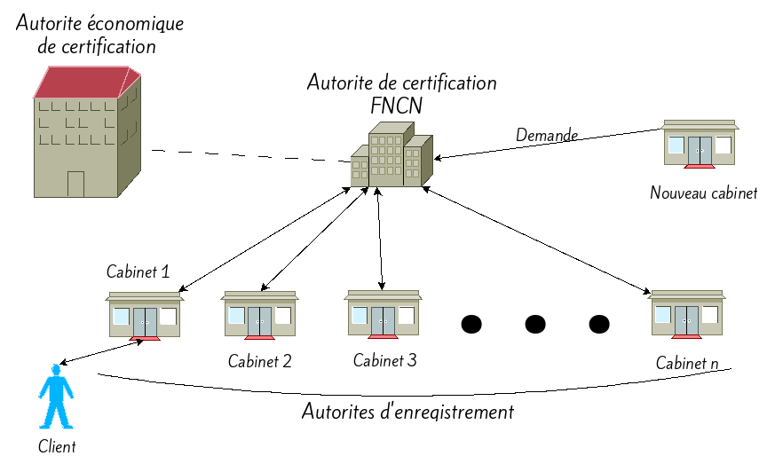

### 2. Feuille de route

**Quelques contraintes a respecter avant de débuter les démarches :**

1- Être de droit algérien pour la personne morale ou de nationalité algérienne pour la personne physique.

2- Disposer de capacités financières suffisantes.

3- Avoir des qualifications et une expérience avérée dans le domaine des technologies de l’information et de la communication pour la personne physique ou le gérant de la personne morale.

4- Ne pas avoir fait l’objet de condamnation pour crime ou délit incompatible avec l’activité de prestation de services de 	certification électronique.

**Démarches a suivre :**

- Définir la structure et la conception du système souhaité
- Préparer une présentation du projet que la FNCN souhaite réaliser
- Définir une politique de certification qui sera respectée à la lettre.
- Contacter l'autorité nationale des certifications pour leurs présenter le projet qui veut être réalisé.
- Présenter la politique de certification choisi par notre FNCN a l'autorité gouvernementale de certification et a l'autorité économique de certification.
- Faire une demande d'autorisation auprès de l’autorité économique de certification électronique pour pouvoir débuter l’activité de certification électronique.
- Acquisition d'une attestation d’éligibilité auprès de l’autorité économique de certification dans un délai de 60 jours après avoir fait la demande, cette attestation permet la mise en place de tous les moyens nécessaires à l’activité de certification électronique et elle a une durée de validité de 1 année renouvelable une seule fois.
- Paiement des frais relatifs a l'autorisation.
- Acquisition de l'autorisation dans un délai maximum de soixante (60) jours à compter de la date de réception de la demande de l’autorisation attestée. Cette autorisation permet de fournir des services de certifications électronique elle est valide pour 5 ans renouvelable.
- L'attestation et l'autorisation doivent être obtenues personnellement sans recours a une tiers partie.
- Réception d'un cahier de charges contenant les conditions et les modalités que la FNCN doit respecter a la lettre.
- Désormais la FNCN peut fournir des services de certification électronique.

**Conditions a respecter:**

- Suivre minutieusement les conditions qui sont indiquées dans le cahier de charge et que la FNCN a approuvé.
- Donner des comptes rendus périodiquement à l'autorité gouvernementale de certification et à l'autorité économique de certification.
- Transmettre les certificats expirées à l'autorité gouvernementale de certification et à l'autorité économique de certification.
- Présenter à l'autorité économique de certification tout document ou information utile pour l'accomplissement des missions de cette dernière.
- Préserver la confidentialité des données et des informations liées aux certificats électroniques délivrés.
- La FNCN ne peut ni conserver, ni copier les données de création de signature de la personne à laquelle elle a fourni un certificat électronique qualifié. 
- Fournir les services en suivant les principes de transparence et de non-discrimination.
- Ne pas refuser de fournir ses services sans motif valable.
- Vérifier l’identité du demandeur du certificat avant de la lui délivrer.
- La FNCN doit prendre les mesures nécessaires afin de répondre à une demande de révocation.
- Appliquer des tarifs pour les services fournis en adéquation avec les principes de tarification définis par l’autorité économique de certification électronique et fixés par voie réglementaire. 
- Souscrire aux assurances prévues dans la politique de certification électronique de l’autorité économique.

**Dans le cas ou la FNCN veut cesser ses activités:**

Informer l’autorité économique de certification électronique dans un délai défini  de son intention de cesser ses activités de prestataire de services de certification électronique afin que cette dernière procède à la révocation de son certificat électronique qualifié.

### 3.  Une spécification technique du parapheur électronique

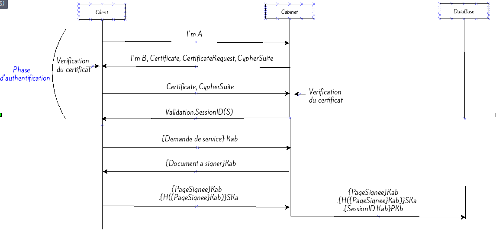

<div class="page-break"></div>
##  C. Sécuriser l'échange entre un client et un serveur web Apache avec SSL

###  1. Créer un espace de Publication Web Apache

1.  **Création du répertoire `delta`**

```bash
> sudo mkdir /opt/lampp/htdocs/delta
```

2.  **Modification du fichier `httpd.conf`**

```bash
> sudo nano /opt/lampp/etc/httpd.conf
```

Le fichier `httpd.conf` correspond a la configuration du serveur `http`.

On fait les modifications suivantes:

```bash
#DocumentRoot "/opt/lampp/htdocs" 
DocumentRoot "/opt/lampp/htdocs/delta" 
#<Directory "/opt/lampp/htdocs"> 
<Directory "/opt/lampp/htdocs/delta"> 
```

3.  **Création du fichier `index.html` pour le serveur `http`**

```bash
> sudo echo "Hello World, This is HTTP server." > /opt/lampp/htdocs/delta/index.html
```

4.  #### Redémarrage de Apache

```bash
> sudo /opt/lampp/lampp restart
```

5.  #### Test

```bash
> sudo firefox http://localhost
```


------


### 2.  Créer un répertoire pour la zone sécurisée

1.  **Création de du répertoire `secure`:**

```bash
> sudo mkdir /opt/lampp/htdocs/delta/secure
```

2.  **Modification du fichier `httpd-ssl.conf`:**

```bash
> sudo nano /opt/lampp/etc/extra/httpd-ssl.conf
```

Le fichier `httpd-ssl.conf` correspond a la configuration de serveur `HTTPS`.

On fait les modifications suivantes:

```bash
#DocumentRoot "/opt/lampp/htdocs" 
DocumentRoot "/opt/lampp/htdocs/delta/secure" 
```

3.  **Création du fichier `index.html` pour le serveur `https`**

```bash
> sudo echo "Hello World, This is a secure HTTP server." > /opt/lampp/htdocs/delta/secure/index.html
```

---------


### 3.  Créer les certificats et les clés pour la CA et le Serveur Web

1.  **Création du certificat du CA:**

On lance tinyca2 par la commande suivante:

```bash
> sudo tinyca2 
```

On remplie les informations de CA comme suit: 

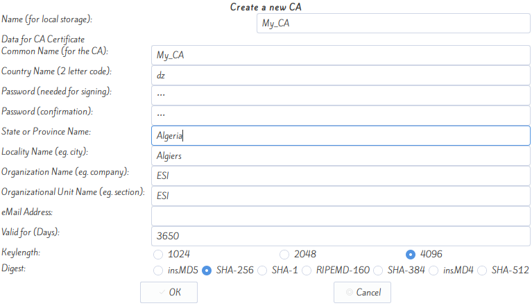

On clique sur OK le résultat est:

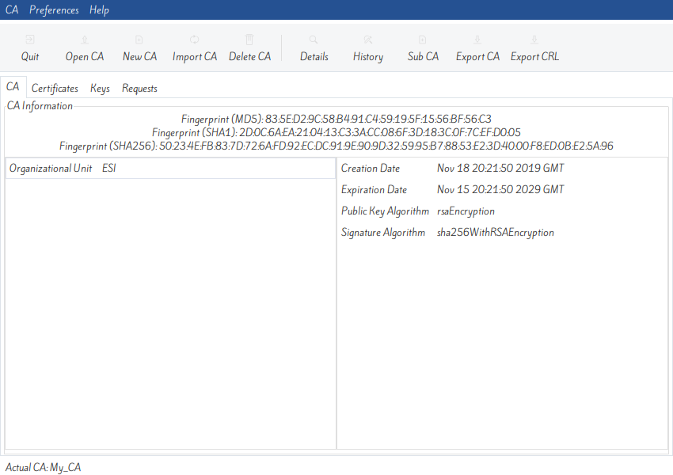

2.  **Création des deux répertoires `cles` et `certifs`**

```bash
> sudo mkdir -p /opt/lampp/etc/delta/cles /opt/lampp/etc/delta/certifs
```

3.  **Création du clé et du certificat de serveur**

On clique sur `New` dans l'angle `certificats` puis on choisi `serveur`

On rempli les informations demandés comme suit:


Puis on sera invité a remplir le mot de pass du CA:


puis on clique sur `export` dans l'angle `Keys`, on rempli la fenêtre comme suit:


On confirme qu'on voulez importer la clé sans mot de passe:


Un message de sucée va être affiche tout suite.

Puis on clique sur l'angle `certificats` puis export et on rempli les informations demandés:

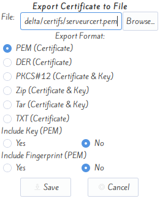

Un message de sucée va être affiche tout suite.

4.  **Modification du fichier `httpd-ssl.conf`**:

On fait les modifications suivantes:

```bash
#SSLCertificateFile /opt/lampp/etc/ssl.crt/server.crt 
SSLCertificateFile /opt/lampp/etc/delta/certifs/serveurcert.pem 
#SSLCertificateKeyFile /opt/lampp/etc/ssl.key/server.key 
SSLCertificateKeyFile /opt/lampp/etc/delta/cles/serveurkey.pem 
```

-------


### 4.  Les tests

1.  **Redémarrage de `apache`**:

```bash
> sudo /opt/lampp/lampp restart
```

2.  **Test**:

```bash
> sudo firefox https://localhost
```

Firefox va demander si on accepte le certificat du serveur

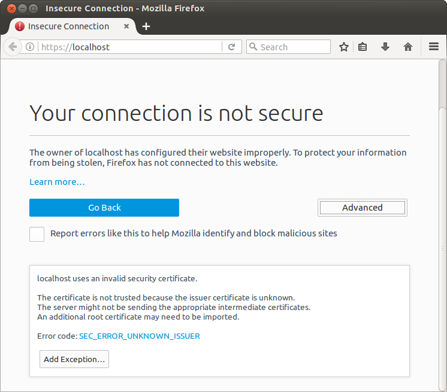

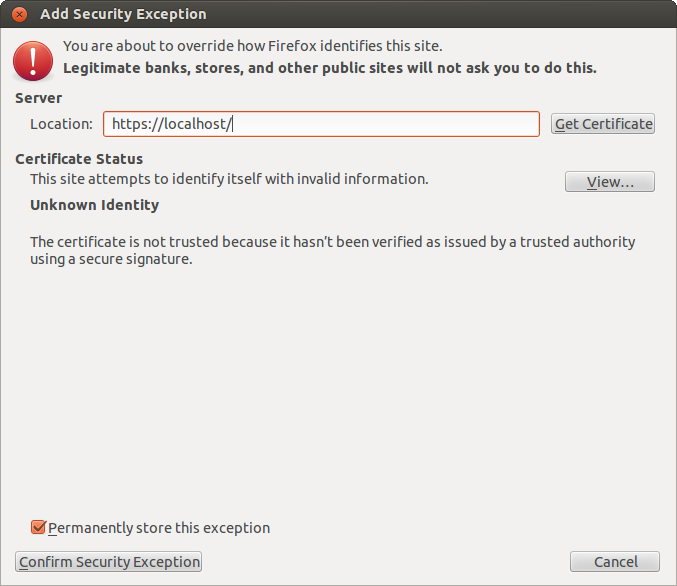

Si on accepte cette certificat la page `index.html` qu'on a inséré a `delta/secure` va être chargé mais avec un avertissement indique que la certificat n'est pas sécurisé.

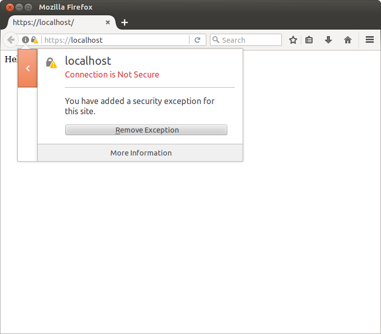

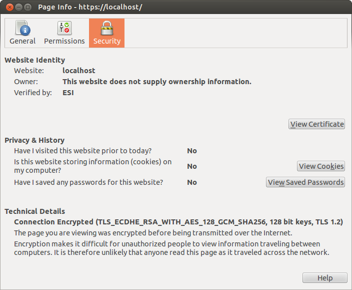

3.  **Exportation du certificat du CA**:

On clique sur l'angle `CA` puis sur `export CA` puis on choisi l'endroit ou on veut enregistrer le certificat du CA


On ajoute le certificat au navigateur. Pour faire on suit les étapes suivantes:

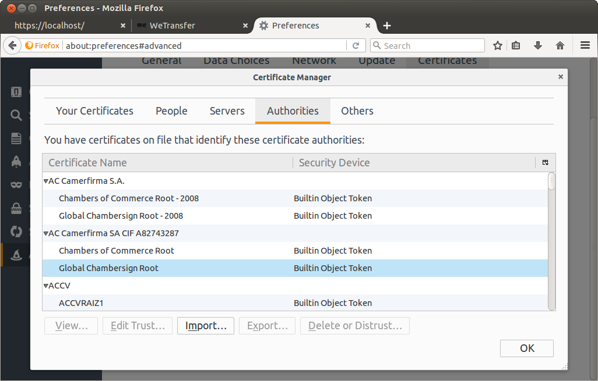


-------


### 5.  Analyse et comparaison des échanges

#### A. Sans authentification du serveur (HTTP)

1.  On remarque que le port utilisé par le serveur est `80` et que le protocole utilisé dans la couche transport pour cette session est `TCP`

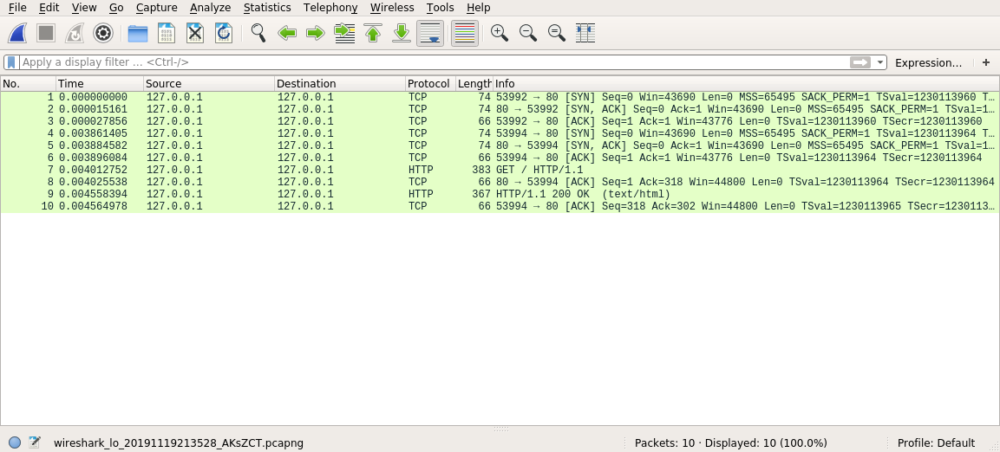

2.  On remarque que les donnes sont envoyé en clair dans la requête `HTTP` (Pas de confidentialité)

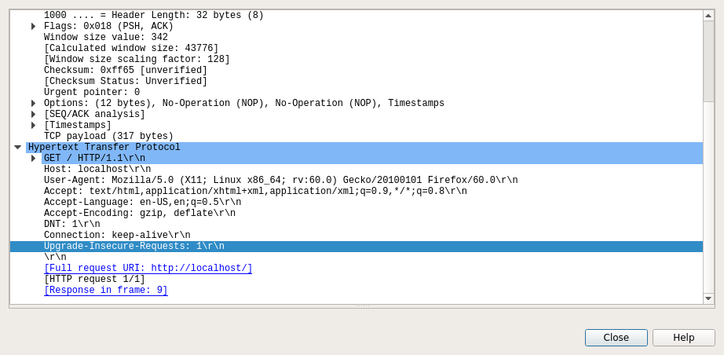

3.  On remarque aussi que la repense du serveur n'est pas crypté

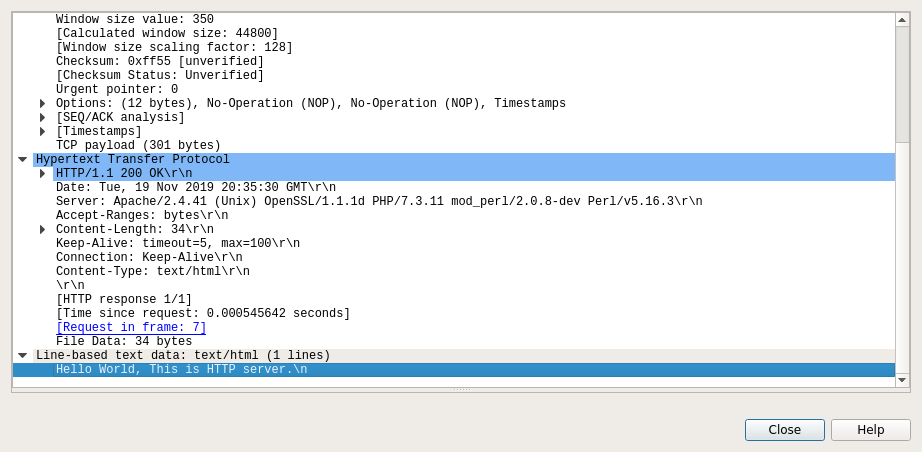

4.  On remarque aussi qu'il n y a pas d'options dans les paquets  pour vérifier l’identité du serveur ou du client

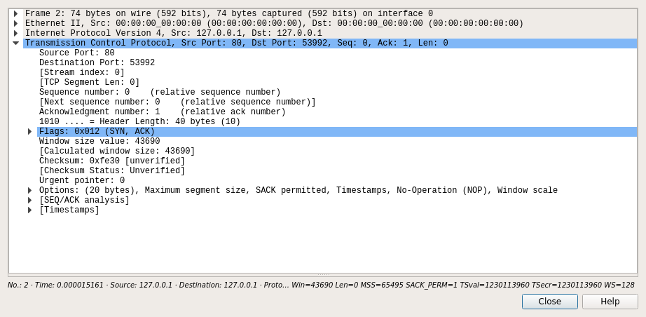

En générale la structure de cette session est la suivante


#### B. Avec authentification du serveur (HTTPS)

1.  On remarque que le port utilisé par le serveur est `443` et qu'on a utilise deux protocoles dans la couche transport `TCP` et `TLS`

    

2.  On remarque que les données sont cryptées dans les requêtes

    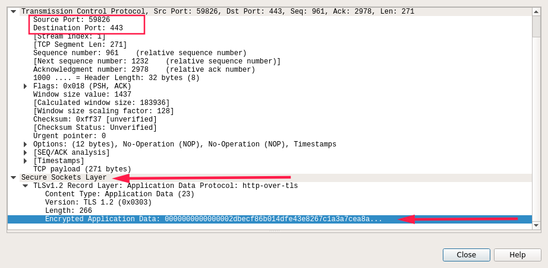

3.  On remarque aussi que les repenses du serveur sont cryptées

    

4.  On remarque qu'il y a des options dans les paquets `TLS`  pour vérifier l’identité du serveur ou du client

    

    

En générale la structure de cette session est la suivante

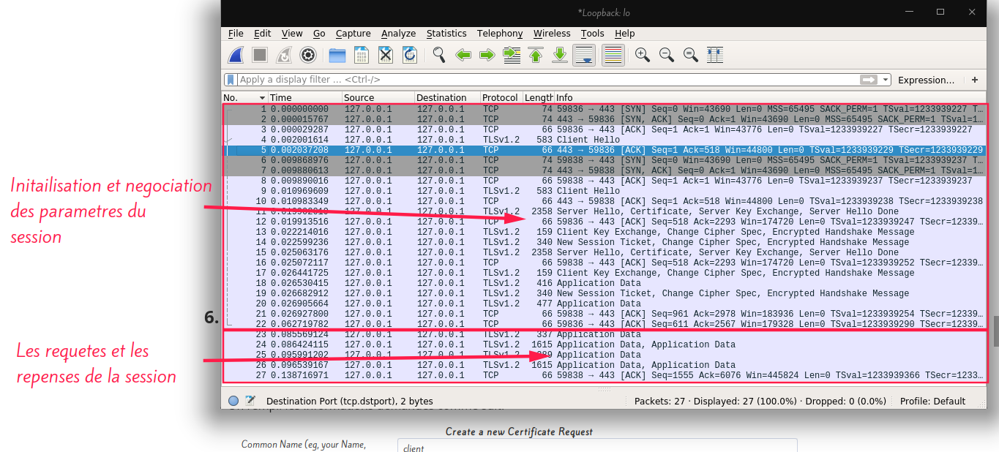

Pour le protocole `SSL`

1.  `ClientHello`

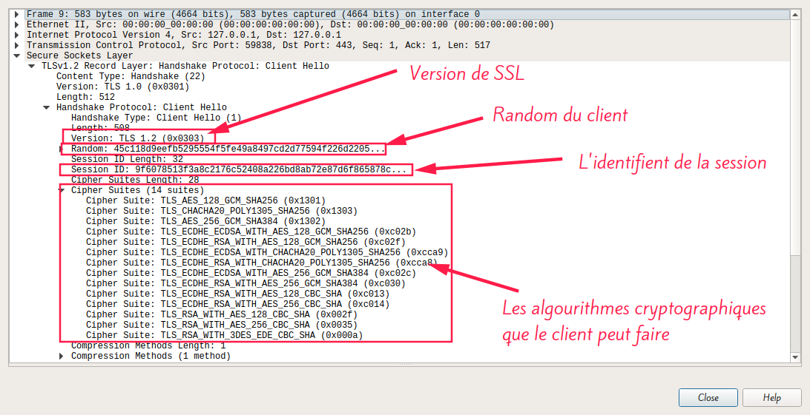

2.  `ServeurHello`

    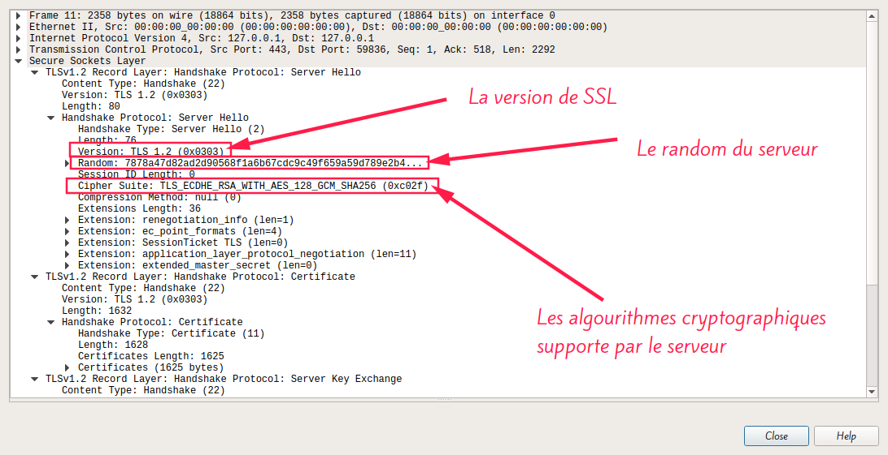

3.  `Certificat` du serveur

    

4.  `ServerkeyExchange`

    

5.  `ServerHelloDone`

    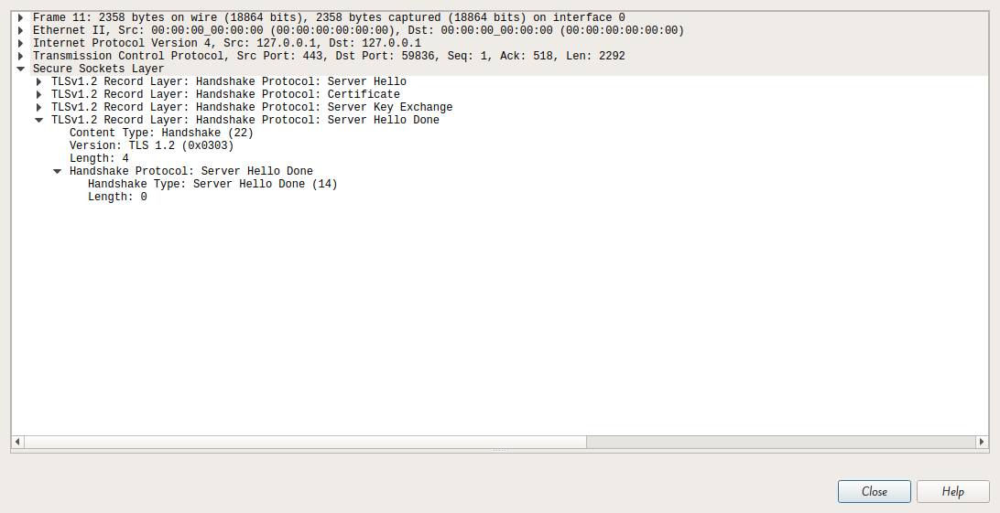

6.  `Clientkeyexchange`

    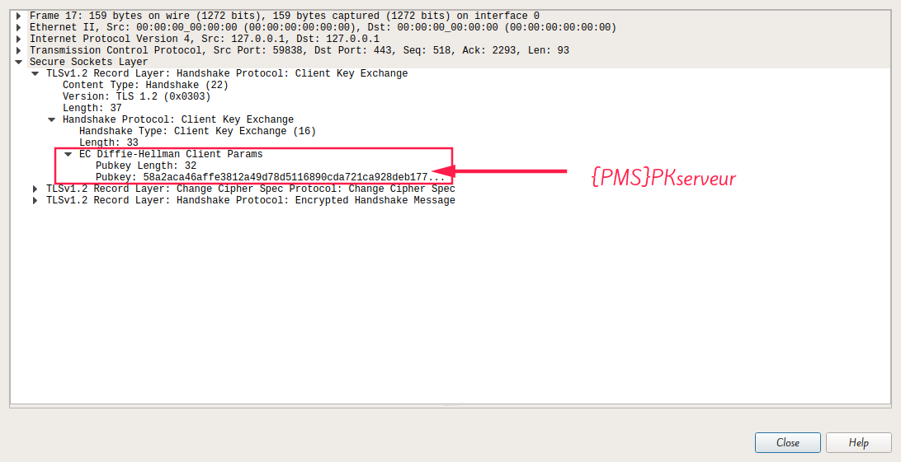

7.  `ChangeSipherSpec` du client

    

8.  `Finished` du client

    

9.  `ChangeSipherSpec` et `Finished` du serveur

    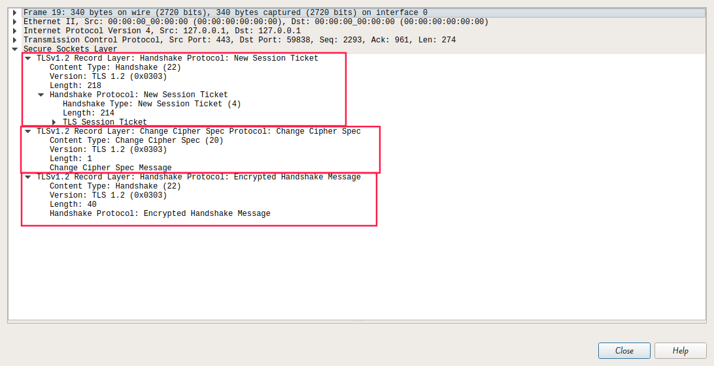

    -----

    

### 6.  Ajouter un certificat Client

1.  **Création du certificat du client**

On clique sur `New` dans l'angle `certificats` puis on choisi `client`

On rempli les informations demandés comme suit:


Puis on sera invité a remplir le mot de pass du CA:


puis on clique sur `export` dans l'angle `Keys` après avoir sélectionner `client`, on rempli la fenêtre comme suit:

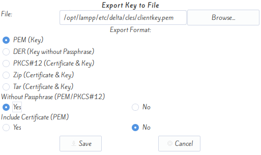

On confirme qu'on voulez importer la clé sans mot de passe:


Un message de sucée va être affiche tout suite.

Puis on clique sur l'angle `certificats` puis `export` après avoir sélectionner `client` et on rempli les informations demandés:


Un message de sucée va être affiche tout suite.

2.  **Modification de apache pour que le serveur exige un certificat pour le client**: 

On ouvre le fichier `httpd-ssl.conf` et on fait le modifications suivantes:

```bash
#SSLCACertificatePath /opt/lampp/etc/ssl.crt 
#SSLCACertificateFile /opt/lampp/etc/ssl.crt/ca-bundle.crt 
SSLCACertificatePath /opt/lampp/etc/delta/certifs/ 
SSLCACertificateFile /opt/lampp/etc/delta/certifs/My_CA-cacert.pem
#SSLVerifyClient require 
#SSLVerifyDepth 10 
SSLVerifyClient require 
SSLVerifyDepth 2 
```

3.  **Testes**

On relance `apache`

```bash
> sudo /opt/lampp/lampp restart
```

On remarque que le client ne peut pas connecter sur le serveur parce que le navigateur ne trouve pas la certificat du client et le serveur demande cette dernier donc le protocole HTTPS génère une alerte au navigateur pour empêcher le client de se connecter au serveur.


Si on analyse cette session on utilisant `Wireshark` on trouve

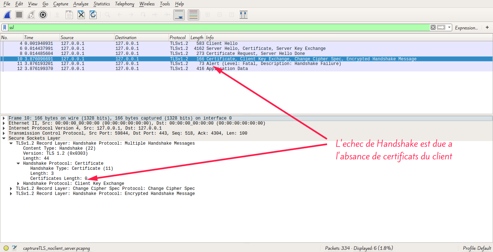

4.  **L'ajout de certificat du client dans le navigateur**:

Puisque `Firefox` n'accepte que les certificats des clients qui a l’extension `.p12` on est obligé de re-exporter la certificat dans cette format en suivant les étapes:


Puis


Ensuit on ajoute la certificat exportée dans le navigateur pour faire :


On clique sur `Import...` puis on choisi le certificat de client crée dans l’étape précédente

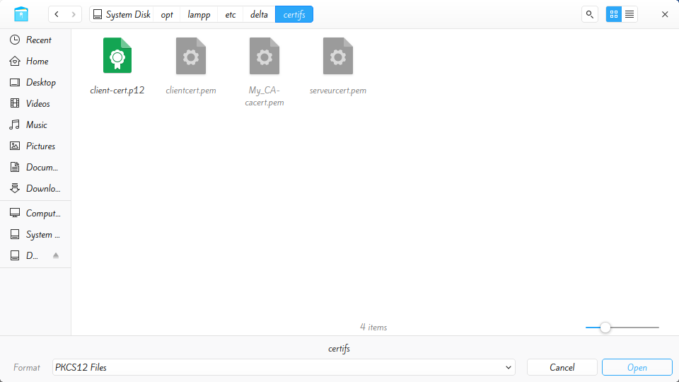

Une fenêtre demandant le mot de passe va apparaître, on la laisse vide 


On remarque qu'une entre va être ajouté a l'angle `Your certificats`

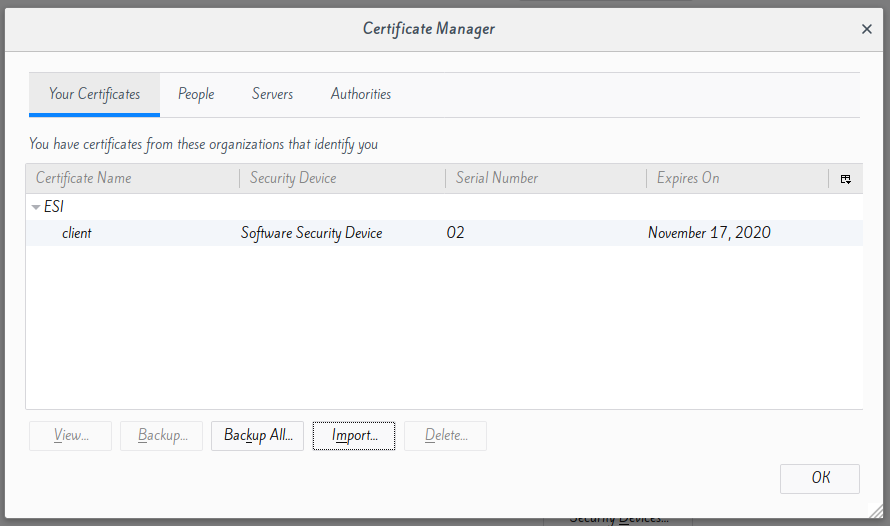

Puis on clique sur `OK`

5.  **Testes**

On relance `apache`

```bash
> sudo /opt/lampp/lampp restart
```

Si on essai d'accéder au serveur via le navigateur on sera invite a choisir une certificats pour être authentifie dans le serveur  


Si on clique sur `OK`, alors on peut accéder au serveur avec toutes sécurité


Dans `Wireshark` on trouve

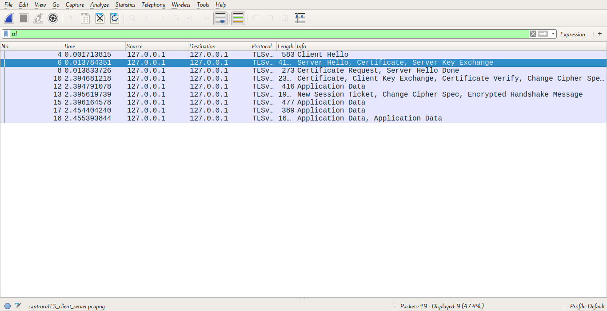

On remarque qu'il y a une authentification mutuel entre le serveur et le client


