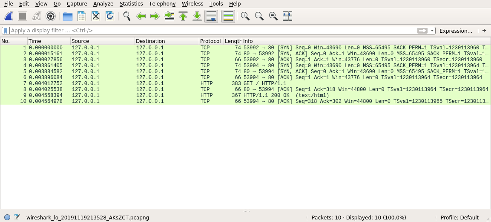
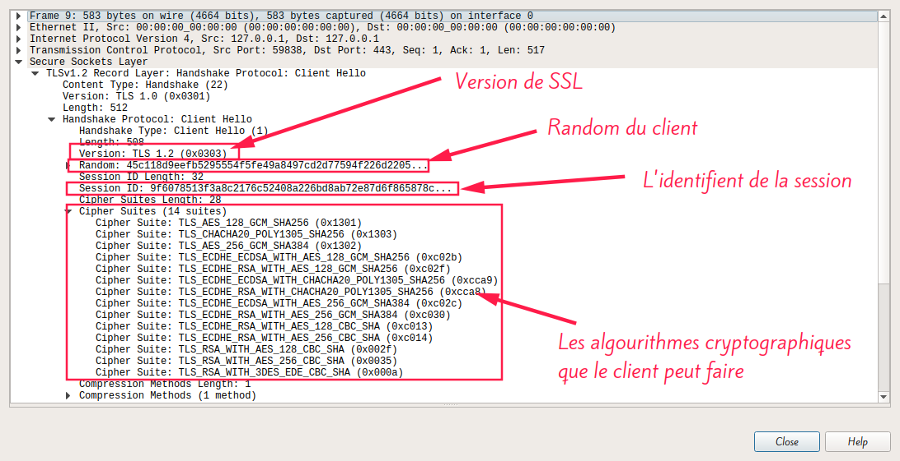
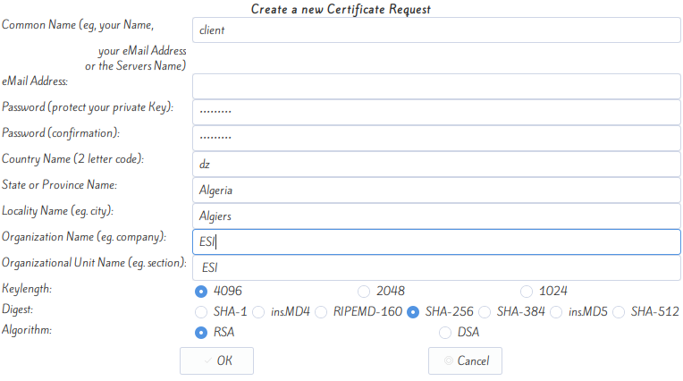
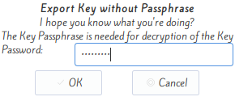
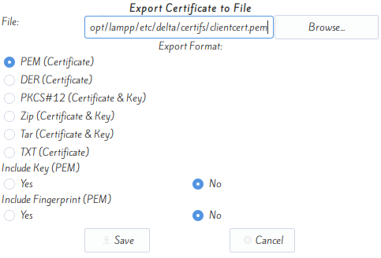
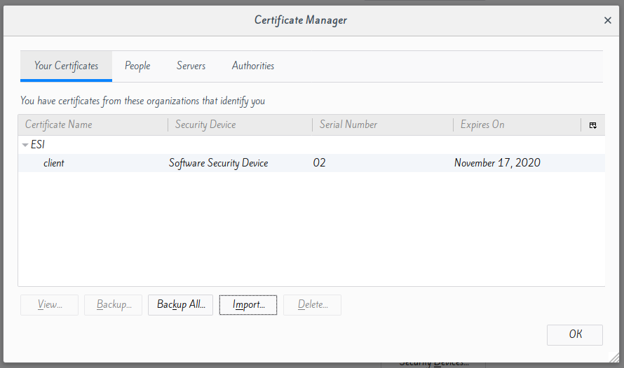

<div style="text-align:center;font-size:30px">﷽</div>


<div style="text-align:center;font-size:48px">Sécuriser l'échange entre un client et un serveur web Apache avec SSL</div>


Travail fait par **CHEBBAH Mehdi** et **HAMMAS Ali Cherif**

---


# Tableau de Contenue

[TOC]

---

#  1. Créer un espace de Publication Web Apache

1.  **Création du répertoire `delta`**

```bash
> sudo mkdir /opt/lampp/htdocs/delta
```

2.  **Modification du fichier `httpd.conf`**

```bash
> sudo nano /opt/lampp/etc/httpd.conf
```

Le fichier `httpd.conf` correspond a la configuration du serveur `http`.

On fait les modifications suivantes:

```bash
#DocumentRoot "/opt/lampp/htdocs" 
DocumentRoot "/opt/lampp/htdocs/delta" 
#<Directory "/opt/lampp/htdocs"> 
<Directory "/opt/lampp/htdocs/delta"> 
```

3.  **Création du fichier `index.html` pour le serveur `http`**

```bash
> sudo echo "Hello World, This is HTTP server." > /opt/lampp/htdocs/delta/index.html
```

4.  #### Redémarrage de Apache

```bash
> sudo /opt/lampp/lampp restart
```

5.  #### Test

```bash
> sudo firefox http://localhost
```


------


# 2.  Créer un répertoire pour la zone sécurisée

1.  **Création de du répertoire `secure`:**

```bash
> sudo mkdir /opt/lampp/htdocs/delta/secure
```

2.  **Modification du fichier `httpd-ssl.conf`:**

```bash
> sudo nano /opt/lampp/etc/extra/httpd-ssl.conf
```

Le fichier `httpd-ssl.conf` correspond a la configuration de serveur `HTTPS`.

On fait les modifications suivantes:

```bash
#DocumentRoot "/opt/lampp/htdocs" 
DocumentRoot "/opt/lampp/htdocs/delta/secure" 
```

3.  **Création du fichier `index.html` pour le serveur `https`**

```bash
> sudo echo "Hello World, This is a secure HTTP server." > /opt/lampp/htdocs/delta/secure/index.html
```

---------


# 3.  Créer les certificats et les clés pour la CA et le Serveur Web

1.  **Création du certificat du CA:**

On lance tinyca2 par la commande suivante:

```bash
> sudo tinyca2 
```

On remplie les informations de CA comme suit: 


On clique sur OK le résultat est:


2.  **Création des deux répertoires `cles` et `certifs`**

```bash
> sudo mkdir -p /opt/lampp/etc/delta/cles /opt/lampp/etc/delta/certifs
```

3.  **Création du clé et du certificat de serveur**

On clique sur `New` dans l'angle `certificats` puis on choisi `serveur`

On rempli les informations demandés comme suit:


Puis on sera invité a remplir le mot de pass du CA:


puis on clique sur `export` dans l'angle `Keys`, on rempli la fenêtre comme suit:


On confirme qu'on voulez importer la clé sans mot de passe:


Un message de sucée va être affiche tout suite.

Puis on clique sur l'angle `certificats` puis export et on rempli les informations demandés:


Un message de sucée va être affiche tout suite.

4.  **Modification du fichier `httpd-ssl.conf`**:

On fait les modifications suivantes:

```bash
#SSLCertificateFile /opt/lampp/etc/ssl.crt/server.crt 
SSLCertificateFile /opt/lampp/etc/delta/certifs/serveurcert.pem 
#SSLCertificateKeyFile /opt/lampp/etc/ssl.key/server.key 
SSLCertificateKeyFile /opt/lampp/etc/delta/cles/serveurkey.pem 
```

-------


# 4.  Les tests

1.  **Redémarrage de `apache`**:

```bash
> sudo /opt/lampp/lampp restart
```

2.  **Test**:

```bash
> sudo firefox https://localhost
```

Firefox va demander si on accepte le certificat du serveur


Si on accepte cette certificat la page `index.html` qu'on a inséré a `delta/secure` va être chargé mais avec un avertissement indique que la certificat n'est pas sécurisé.


3.  **Exportation du certificat du CA**:

On clique sur l'angle `CA` puis sur `export CA` puis on choisi l'endroit ou on veut enregistrer le certificat du CA


On ajoute le certificat au navigateur. Pour faire on suit les étapes suivantes:


-------


# 5.  Analyse et comparaison des échanges

### A. Sans authentification du serveur (HTTP)

1.  On remarque que le port utilisé par le serveur est `80` et que le protocole utilisé dans la couche transport pour cette session est `TCP`



2.  On remarque que les donnes sont envoyé en clair dans la requête `HTTP` (Pas de confidentialité)


3.  On remarque aussi que la repense du serveur n'est pas crypté


4.  On remarque aussi qu'il n y a pas d'options dans les paquets  pour vérifier l’identité du serveur ou du client


En générale la structure de cette session est la suivante


### B. Avec authentification du serveur (HTTPS)

1.  On remarque que le port utilisé par le serveur est `443` et qu'on a utilise deux protocoles dans la couche transport `TCP` et `TLS`

    

2.  On remarque que les données sont cryptées dans les requêtes

    

3.  On remarque aussi que les repenses du serveur sont cryptées

    

4.  On remarque qu'il y a des options dans les paquets `TLS`  pour vérifier l’identité du serveur ou du client

    

    

En générale la structure de cette session est la suivante


Pour le protocole `SSL`

1.  `ClientHello`



2.  `ServeurHello`

    

3.  `Certificat` du serveur

    

4.  `ServerkeyExchange`

    

5.  `ServerHelloDone`

    

6.  `Clientkeyexchange`

    

7.  `ChangeSipherSpec` du client

    

8.  `Finished` du client

    

9.  `ChangeSipherSpec` et `Finished` du serveur

    

    -----

    

# 6.  Ajouter un certificat Client

1.  **Création du certificat du client**

On clique sur `New` dans l'angle `certificats` puis on choisi `client`

On rempli les informations demandés comme suit:



Puis on sera invité a remplir le mot de pass du CA:


puis on clique sur `export` dans l'angle `Keys` après avoir sélectionner `client`, on rempli la fenêtre comme suit:


On confirme qu'on voulez importer la clé sans mot de passe:



Un message de sucée va être affiche tout suite.

Puis on clique sur l'angle `certificats` puis `export` après avoir sélectionner `client` et on rempli les informations demandés:



Un message de sucée va être affiche tout suite.

2.  **Modification de apache pour que le serveur exige un certificat pour le client**: 

On ouvre le fichier `httpd-ssl.conf` et on fait le modifications suivantes:

```bash
#SSLCACertificatePath /opt/lampp/etc/ssl.crt 
#SSLCACertificateFile /opt/lampp/etc/ssl.crt/ca-bundle.crt 
SSLCACertificatePath /opt/lampp/etc/delta/certifs/ 
SSLCACertificateFile /opt/lampp/etc/delta/certifs/My_CA-cacert.pem
#SSLVerifyClient require 
#SSLVerifyDepth 10 
SSLVerifyClient require 
SSLVerifyDepth 2 
```

3.  **Testes**

On relance `apache`

```bash
> sudo /opt/lampp/lampp restart
```

On remarque que le client ne peut pas connecter sur le serveur parce que le navigateur ne trouve pas la certificat du client et le serveur demande cette dernier donc le protocole HTTPS génère une alerte au navigateur pour empêcher le client de se connecter au serveur.


Si on analyse cette session on utilisant `Wireshark` on trouve


4.  **L'ajout de certificat du client dans le navigateur**:

Puisque `Firefox` n'accepte que les certificats des clients qui a l’extension `.p12` on est obligé de re-exporter la certificat dans cette format en suivant les étapes:


Puis


Ensuit on ajoute la certificat exportée dans le navigateur pour faire :


On clique sur `Import...` puis on choisi le certificat de client crée dans l’étape précédente


Une fenêtre demandant le mot de passe va apparaître, on la laisse vide 


On remarque qu'une entre va être ajouté a l'angle `Your certificats`



Puis on clique sur `OK`

5.  **Testes**

On relance `apache`

```bash
> sudo /opt/lampp/lampp restart
```

Si on essai d'accéder au serveur via le navigateur on sera invite a choisir une certificats pour être authentifie dans le serveur  


Si on clique sur `OK`, alors on peut accéder au serveur avec toutes sécurité


Dans `Wireshark` on trouve


On remarque qu'il y a une authentification mutuel entre le serveur et le client


